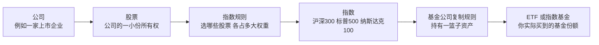
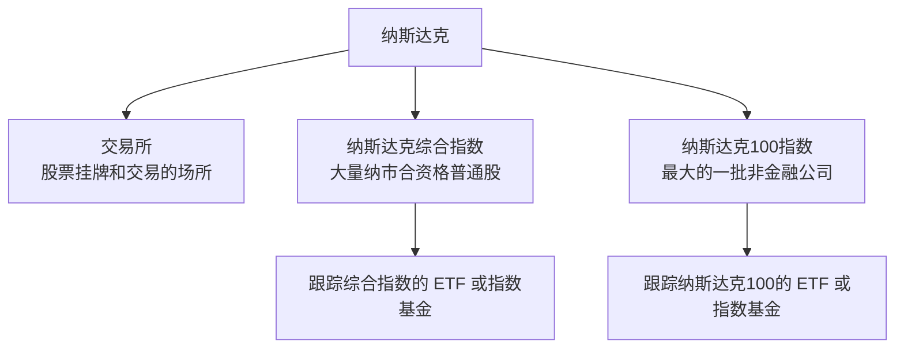

> **资料快照 · 2026 年 8 月 13 日**
>
> 这是一篇投资者教育笔记，不是产品推荐，也不是对任何市场或基金未来表现的判断。文中的产品名称、代码、费用、申购状态和持仓快照均以文内链接的官方文件为准；它们会变化，真正下单前请重新阅读基金公司的**最新**产品资料概要、招募说明书和公告。

很多人第一次听到“长期买标普”“定投纳指”，脑中会出现一个合理但错误的画面：是不是有人把“标普500”或者“纳斯达克”当成一只股票在买？

不是。

**标普500、沪深300、纳斯达克100都是指数；你真正能下单买的，通常是一只跟踪它们的 ETF 或指数基金。** 这篇文章不假设你知道任何术语。我们从“公司为什么能有股票”开始，最后把手机里可能看到的 `159941`、`016452` 这样的代码放回它们应在的位置。

## 先把结论放在最前面

| 你看到的东西 | 它到底是什么 | 能不能直接下单买 |
| --- | --- | --- |
| 贵州茅台、苹果 | 一家公司的**股票** | 可以 |
| A 股 | 在中国内地交易所上市、以人民币交易的一类股票 | 可以买其中的具体股票 |
| 上交所、深交所、纳斯达克 | 股票买卖发生的**交易所／市场** | 不能把“整个交易所”当作一只股票买 |
| 沪深300、标普500、纳斯达克100 | 按规则挑出一篮子股票后算出的**指数** | 不能直接买指数点位 |
| 沪深300 ETF、标普500 ETF、纳指100 ETF | 尽量复制某个指数表现的**基金产品** | 可以 |

因此，日常语言里的“我买了纳指”，严谨地翻译应该是：

> 我买了一只**跟踪纳斯达克100指数**的基金份额；它可能是盘中交易的 ETF，也可能是每天按净值确认的普通开放式基金。

这两种产品都可能给你类似的“纳指100暴露”，但买卖方式、价格形成、代码含义和需要留意的风险并不相同。



## 第一层：股票与 A 股，先别把“股”理解成指数

### 股票是一家公司的所有权份额

公司需要融资时，可以把自身所有权拆成很多小份，向公众发行。每一份通常叫做一股。你买入一只股票，买到的是这家公司的一小份权益；公司经营、盈利、分红预期、市场供求等都会影响其价格。

例如：

```text
苹果 = 一家具体的公司
苹果股票 = 对苹果的一小份所有权
```

这与“标普500”完全不是一个层级。标普500不是公司，也没有董事会、产品和利润；它是一套用来观察一篮子公司表现的公开规则。

### A 股的 A，不是“评级 A”

**A 股**是中国内地市场的历史分类名称。可先把它记作：内地公司在上海或深圳证券交易所上市、以人民币认购和交易的普通股。上交所的介绍把 A 股定义为“以人民币计价的普通股”；港交所的投资者材料也把 A 股与在香港上市的 H 股、以外币计价的 B 股分别说明。[上交所股票市场说明](https://english.sse.com.cn/markets/equities/overview/)｜[港交所 A/B/H 股说明 PDF](https://www.hkex.com.hk/-/media/HKEX-Market/Products/Securities/Equities/Equities-leaflet/equities.pdf)

它不是“非正规市场”。A 股交易发生在上交所、深交所这样的正规交易所，具有上市、交易、信息披露、清算结算和监管规则。

为了不混淆，先用这个最小地图：

| 名称 | 先看什么 | 白话解释 |
| --- | --- | --- |
| A 股 | 上市地：上海／深圳；币种：人民币 | 内地证券市场中的股票 |
| H 股 | 公司注册地：内地；上市地：香港 | H 是 Hong Kong，不等于全部港股 |
| 港股 | 上市地：香港 | 一个更大的集合，可包含 H 股、香港本地公司、红筹等 |
| 美股 | 上市地：美国交易所 | 也不是一个单一指数或单一产品 |

同一家公司可以同时有 A 股与 H 股。它们对应同一家公司，却在不同市场、不同币种和不同供求环境里交易，价格不必一样。

## 第二层：指数不是一个“可以买到的东西”

### 指数 = 菜谱 + 每天按菜谱算出的成绩

把指数理解成“市场温度计”很有用，但还可以再精确一点：

**指数是一套公开的选股和计算规则，以及按这些规则每日计算出来的数值。**

一套完整的指数规则至少会写清：

1. **股票池从哪里来**：例如沪深市场、港交所主板、美国交易所。
2. **哪些股票能入选**：市值、流动性、行业、上市时间、盈利状况等条件。
3. **每只股票占多少权重**：按自由流通市值、等权重，或设置单一公司权重上限。
4. **多久调一次仓**：季度、半年或年度调整；新股、并购、退市时如何处理。
5. **算哪种收益**：只看股价变动的价格指数，还是把股息再投入的全收益／净收益指数。

所以，指数不是屏幕上的“6000点”而已。**6000点也不是 6000 元的价格。** 不同指数有不同基日、基点和计算方法；把沪深300的点位与标普500、恒生科技的点位直接比较“谁贵”，没有意义。

### 五个常见名字，到底各自挑了谁？

| 指数 | 主要股票池与规则 | 它更像是在看什么 | 不要误解成 |
| --- | --- | --- | --- |
| 沪深300 | 从沪深市场合格证券中选出 300 只大市值、流动性较好的代表性证券；自由流通市值调整 | 中国内地 A 股大盘核心 | “中国所有公司” |
| 标普500 | 约 500 家美国大型公司，覆盖多个行业；自由流通市值加权 | 美国大盘股基准 | “美国全部股票” |
| 纳斯达克100 | 纳斯达克上市的最大一批**非金融**公司；修正市值加权 | 美股大型成长／科技倾向 | “纳斯达克全部股票”或“纯软件指数” |
| 纳斯达克综合指数 | 纳斯达克市场中大量合资格的普通股类证券 | 纳斯达克上市股票的大范围表现 | 纳斯达克100的另一个名字 |
| 恒生科技 | 香港上市、科技主题暴露高的 30 家公司；自由流通市值加权并设权重限制 | 港股科技主题 | “A 股科技指数” |

上表的规则并非凭印象总结：可以直接看 [沪深300编制方案 PDF](https://oss-ch.csindex.com.cn/static/html/csindex/public/uploads/indices/detail/files/zh_CN/000300_Index_Methodology_cn.pdf)、[标普500官方介绍](https://www.spglobal.com/spdji/en/indices/equity/sp-500/)、[纳斯达克100方法论 PDF](https://indexes.nasdaqomx.com/docs/methodology_NDX.pdf)、[纳斯达克综合指数事实表 PDF](https://indexes.nasdaqomx.com/docs/FS_COMP.pdf) 与 [恒生科技方法论 PDF](https://www.hsi.com.hk/static/uploads/contents/en/dl_centre/methodologies/IM_hsteche.pdf)。

### 为什么指数要存在？

指数至少有三种作用：

- **观察市场**：新闻里说“标普500上涨”，是在概括一组大型美股的整体表现。
- **做业绩标尺**：主动基金可以拿某个指数作比较基准，回答“相对这一篮子股票表现如何”。
- **让被动投资有公开菜谱**：基金公司不必凭基金经理的偏好挑选，而是可以按既定规则复制指数。

第三种用途，就是 ETF 和指数基金出现的原因。

## 第三层：ETF 是把“菜谱”变成可交易产品的容器

### ETF 并不等于指数

ETF 是 *Exchange-Traded Fund*，即“交易所交易基金”。它把很多投资者的资金汇集为一个基金组合，基金份额可以在交易所里盘中买卖。美国 SEC 的投资者教育材料也强调：ETF 持有人拥有的是基金投资组合的一部分，而不是直接拥有那一整张指数。[ETF 官方投资者教育说明](https://www.investor.gov/introduction-investing/investing-basics/investment-products/mutual-funds-and-exchange-traded-2)

用一句话分开：

```text
指数：告诉你“该买哪一篮子、每只占多大比例”的规则和成绩。
ETF：基金公司尽量照这份规则装好一篮子真实资产后，卖给你的基金份额。
```

这解释了为什么“买标普500”通常不是把“标普500”这四个字买进账户，而是买入某一只**标普500 ETF**或普通指数基金。

### ETF、普通指数基金、ETF 联接基金：像，但不完全一样

| 类型 | 你通常在哪里下单 | 成交／确认方式 | 你买到什么 | 一个常见误解 |
| --- | --- | --- | --- | --- |
| 场内 ETF | 证券账户 | 交易日盘中按市场价格买卖 | 交易所挂牌的基金份额 | “ETF价格必定等于净值” |
| 普通开放式指数基金 | 基金销售平台、银行、基金公司等 | 常见为交易日截止时间后按净值确认 | 开放式基金份额 | “只要跟踪指数，就一定是 ETF” |
| ETF 联接基金 | 基金销售平台等 | 常见为按净值申购、赎回 | 主要投资于目标 ETF 的开放式基金份额 | “它是另一只同样在场内交易的 ETF” |

一个指数可以有多只基金来跟踪；同一指数、不同基金公司、不同份额类别的费率、交易市场、货币、申赎机制和跟踪误差都可能不同。反过来，ETF 也不一定是指数型 ETF；还存在主动管理 ETF。指数基金也不一定是 ETF，它还可以是普通开放式基金。[指数基金官方投资者教育说明](https://www.investor.gov/introduction-investing/investing-basics/glossary/index-fund)

### 为什么 ETF 的“交易价”可能和基金净值不同？

普通基金的申购、赎回通常围绕每日净值确认；但 ETF 在二级市场里像股票一样交易。因此 ETF 盘中有两个容易混淆的数字：

- **交易价格**：买卖双方在交易所里实际成交的价格。
- **基金净值／IOPV**：基金资产价值的估算或参考值。IOPV 常被用作盘中参考，不等于你一定能以它成交。

交易价格高于参考净值叫**溢价**，低于参考净值叫**折价**。这部分差异不是指数本身涨跌，也不天然代表“多赚了”。尤其是跨境 ETF，还会受到时区、底层市场开闭市、申赎安排、流动性和情绪等影响。

## 一个语言陷阱：“纳斯达克ETF”到底指什么？

“纳斯达克”这个词至少可能指三层东西：



因此，口头说“纳指ETF”并不够精确。许多人实际指的是“**纳斯达克100 ETF**”，但行情页面上写的 “NASDAQ” 又经常是在说**纳斯达克综合指数**。两者不是同一个指数：前者只看 100 家最大的纳市非金融公司，后者覆盖范围更广，也包含金融等行业。纳斯达克官方也专门解释了这一区别。[Nasdaq Composite vs. Nasdaq-100](https://www.nasdaq.com/newsroom/nasdaq-composite-vs-nasdaq-100-what-investors-should-know)

所以，看到一个基金名称时，最有用的问题不是“它是不是纳指”，而是：

> 它的**跟踪标的／业绩比较基准**完整写的是什么？是 Nasdaq-100，还是 Nasdaq Composite，还是另一个纳斯达克系列指数？

同理，“标普纳指500ETF”不是规范的完整产品名称。它多半是把“标普500 ETF”和“纳指100 ETF”连着说，或者漏了逗号；不要把标普的“500”移动到纳斯达克身上，形成并不存在的“纳指500”。

## 用真实产品把“买纳指”讲透

以下不是推荐清单，而是两种常见产品结构的实物标本。它们之所以值得并排看，是因为**同样提到纳斯达克100，买的路径可以完全不同。**

### 样本一：广发纳指100ETF，代码 159941 —— 这才是场内 ETF

广发基金的这只产品全称为“广发纳斯达克100交易型开放式指数证券投资基金”。基金代码是 **159941**，基金简称为“广发纳指100ETF”；在券商软件的场内简称可能显示为“纳指ETF 广发”或类似写法，所以**代码比简称更可靠**。[广发基金产品页](https://www.gffunds.com.cn/funds/?fundcode=159941)｜[2026 年产品资料概要 PDF](https://www.gffunds.com.cn/jjgg/flwj/202607/P020260706332730818714.pdf)

| 核对项 | 159941 的官方资料写了什么 | 这句话对小白意味着什么 |
| --- | --- | --- |
| 产品类型 | QDII 场内 ETF | 它在深交所挂牌，可在交易日盘中通过证券账户买卖 |
| 基金合同生效／上市 | 2015-06-10／2015-07-13 | 这是该 ETF 本身的时间线，不要和联接基金的更早时间混在一起 |
| 跟踪标的 | 纳斯达克100指数 | 买到的不是“纳斯达克交易所全部股票” |
| 业绩比较基准 | 汇率调整后的纳斯达克100指数收益率 | 人民币投资者的实际体验还会涉及汇率等因素 |
| 运作方式 | 主要采取完全复制策略 | 基金目标是尽量贴近指数，不是让经理自由挑几只热门科技股 |
| 交易货币 | 人民币 | 你在境内交易的是人民币计价的基金份额，底层敞口仍与美元资产相关 |

#### 一个很重要的真实例子：不要只看“它跟纳指”

广发在 2026 年 6 月的一则风险提示中披露：159941 当日二级市场收盘价为 **1.6860 元**，而基金份额参考净值 IOPV 为 **1.5500 元**。粗略计算的溢价约为 `1.6860 ÷ 1.5500 - 1 = 8.77%`。[风险提示公告 PDF](https://www.gffunds.com.cn/jjgg/zdsj/202606/P020260623320594481081.pdf)

这个例子不是让人记住某个历史数字，而是帮助理解一件事：

```text
纳斯达克100当天的涨跌
≠ 你在 A 股盘中买这只 ETF 时必然拿到的成交价格变化
```

如果你在溢价很高时买入，之后即使底层指数没有下跌，溢价回落也可能让你的持有市值承压。因此，场内 ETF 要同时看“跟踪什么”与“当前交易价相对净值是否存在明显折溢价”。

### 同一条链上的另一个东西：广发 270042 等“ETF 联接基金”

广发还有“广发纳斯达克100交易型开放式指数证券投资基金联接基金（QDII）”。它与 159941 有关联，却不是另一只可在盘中交易的同名 ETF。

| 份额类别 | 常见代码 | 先记住什么 |
| --- | ---: | --- |
| 人民币 A 类 | 270042 | 普通开放式基金份额代码 |
| 人民币 C 类 | 006479 | 同一联接基金的另一类收费结构 |
| 人民币 F 类 | 021778 | 同一联接基金的另一类份额 |
| 美元 A／C 类 | 000055／006480 | 同一联接基金的美元份额代码 |

这只联接基金的核心逻辑是：主要投资目标 ETF，也就是上面的 159941；官方文件明确它与目标 ETF 是不同产品、不同份额，目标 ETF 的成立和上市时间不能倒过来当作联接基金的成立时间。[广发 270042 产品页](https://www.gffunds.com.cn/funds/?fundcode=270042)｜[联接基金招募说明书 PDF](https://www.gffunds.com.cn/jjgg/flwj/202606/P020260605334094923477.pdf)

所以，“我在基金 App 里申购了 270042”与“我在证券账户盘中买入了 159941”，不是同一笔交易；它们只是绕向纳斯达克100的两条不同产品路径。

### 样本二：南方纳斯达克100，代码 016452／016453／021000 —— 它不是 ETF

这是新手最容易因为名称而误判的例子。南方基金的“南方纳斯达克100指数发起式证券投资基金（QDII）”确实跟踪纳斯达克100，但它是**普通开放式 QDII 指数基金**，不是在上交所或深交所挂牌交易的 ETF，也不是 ETF 联接基金。

| 份额类别 | 代码 | 它不是 |
| --- | ---: | --- |
| A 类 | 016452 | 不是场内 ETF 证券代码 |
| C 类 | 016453 | 不是第二只独立的纳指产品 |
| I 类 | 021000 | 不是可盘中交易的 ETF |

这三个代码是同一只基金的不同份额类别。它们常见于基金销售平台，按该基金的申购、赎回与净值确认规则运作。基金合同于 2022-11-29 生效；I 类份额于 2024-03-19 开放。[南方基金招募说明书 PDF](https://www.nffund.com/main/files/2025/10/21/373216081474.pdf)｜[A 类产品资料概要 PDF](https://www.nffund.com/main/files/2025/10/21/372412993470.pdf)

南方这只基金的标的指数仍是 Nasdaq-100；其业绩比较基准则写为“经汇率调整后的纳斯达克100指数收益率 × 95% + 银行人民币活期存款利率（税后）× 5%”。这提醒我们：**“跟踪纳指100”不等于基金每天会与指数一模一样。** 留存现金、费用、汇率、交易成本和跟踪误差都会造成差异。

#### 一个组合快照：所谓“纳指”不等于 100 只股票平均分

下面的数据来自南方该基金 2026 年二季度报告，截点为 2026-06-30；它不是实时仓位，更不是对未来持仓的承诺，只用来说明指数化产品也有明显的行业结构。[2026 年二季度报告 PDF](https://www.nffund.com/main/files/2026/07/20/493896699097.pdf)

| 行业（报告口径） | 占基金资产净值比例 |
| --- | ---: |
| 科技 | 53.81% |
| 通讯 | 12.41% |
| 非必需消费 | 8.52% |
| 必需消费 | 5.54% |
| 医疗保健 | 3.16% |
| 工业 | 2.97% |
| 公用事业 | 1.01% |
| 材料 | 0.92% |
| 能源 | 0.40% |
| 金融 | 0.15% |

从这张表能读出的不是“科技一定更好”，而是更朴素的一件事：**纳斯达克100并不等于一份平均分散的美国股票篮子。** 它有相当明显的成长／科技倾向与行业集中度；指数基金的“分散”只是在它的规则范围内分散，不是“所有风险都被消掉”。

#### 申购限额为什么要单独看？

跨境 QDII 产品的开放与限购状态会随公告改变。以南方这只基金为例，2026 年 7 月的公告曾把 A、C 类的单日申购、定投与转换转入限额调整为 10 元，I 类为 200 元；这只是一个说明“状态会变”的时间点，不是永久规则。[A/C 类公告 PDF](https://www.nffund.com/main/files/2026/07/08/015716542930.pdf)｜[I 类公告 PDF](https://www.nffund.com/main/files/2026/07/20/267420143677.pdf)

对新手最实用的动作不是背住数字，而是下单前打开产品页面，确认：

1. 今天是否开放申购、单日上限是多少；
2. 你买的是 A、C 还是 I 类；
3. 截止时间、确认日期、赎回到账时间如何规定；
4. 该产品的境外市场节假日是否会影响申赎。

### 这两个样本放在一起，差别就很清楚了

| 问题 | 广发 159941 | 南方 016452／016453／021000 |
| --- | --- | --- |
| 名称中有没有“纳斯达克100” | 有 | 有 |
| 是否跟踪 Nasdaq-100 | 是 | 是 |
| 是不是场内 ETF | 是 | 否 |
| 常见下单位置 | 证券账户 | 基金销售渠道 |
| 盘中是否有市场成交价 | 有 | 不以盘中撮合价格买卖 |
| 代码代表什么 | 交易所挂牌的 ETF 代码 | 同一开放式基金的不同份额类别代码 |
| 要优先警惕什么 | 折溢价、IOPV、流动性 | 限购、确认时间、份额费用与境外市场日历 |

**基金公司名称不能替代产品类型判断。** 即使同一家公司同时管理场内 ETF 和场外开放式基金，也必须回到这只产品自己的全称、交易地点和基金合同来判断；不能因为它跟踪的是同一个海外指数，就把它都叫作“ETF”。

## 看到一只产品时，按这八步读，不容易被名字带偏

### 1. 先抄完整名称与代码

不要只搜“纳指”“标普”或“科技”。完整名称与代码是唯一可靠的身份证。简称可能改、不同平台显示可能略有差异，代码和法律文件更稳定。

### 2. 判断它是 ETF、普通开放式基金，还是 ETF 联接基金

这一步决定你是在盘中按市场价交易，还是在申购／赎回后按净值确认。也决定了你需要看折溢价，还是需要看申购限额、确认时间等规则。

### 3. 找到“标的指数”或“业绩比较基准”的全名

不要把“纳斯达克”当作完整答案。至少要判断：

```text
Nasdaq-100？
Nasdaq Composite？
纳斯达克生物科技指数？
还是别的纳斯达克系列指数？
```

同理，“恒生科技”“恒生指数”“恒生国企指数”也都是不同规则下的不同篮子。

### 4. 看持仓范围，而不是只看产品标题

指数产品并非每只股票等权。大市值加权意味着大公司影响更大；行业主题指数意味着某些行业更集中。可以看最近季报的前十大持仓、行业配置和资产配置，但要把它们当作**报告期快照**，而非永久名单。

### 5. 场内 ETF 要看交易价、净值与折溢价

交易价格高不一定说明指数表现更好，低也不自动说明“捡漏”。先确认底层市场是否开市、IOPV 是否可参考、折溢价是否异常，再理解自己正在以什么价格买一篮子资产。

### 6. 普通 QDII 基金要看申购状态、时差和汇率

海外市场的交易时间与境内不同，基金还可能因境外节假日、额度或公告安排调整申赎。人民币计价并不等于没有汇率影响；你承担的资产表现往往仍和境外货币资产有关。

### 7. 看产品资料概要里的费用，而不是只比较名字

费用随份额类别、销售渠道、持有时间和未来公告而变。举例来说，南方纳斯达克100的 A、C、I 类在申购费和销售服务费上就不同；广发的 ETF 与联接基金也有不同层级的费用披露。最稳妥的做法是阅读当下有效的“基金产品资料概要”，而不是照搬别人截屏中的历史数字。

### 8. 把“长期”翻译成可以承受的风险，而不是保证

长期持有是一种时间安排，不是收益承诺。股票型基金会波动，指数也会大幅回撤；过去涨得好、热门、名字熟悉，都不能代替你对风险承受能力、资金用途、投资期限和资产配置的判断。基金公司在每份产品资料中都会提示“不保证盈利”“过往业绩不代表未来表现”，这不是格式化废话，而是产品本身的事实。

## 五个最常见的误会，最后一次性清掉

### 误会一：“指数基金”就是一只股票

不是。指数基金／ETF 是基金，持有的是一篮子资产；单只股票是对一家公司的权益。它们都可能在证券账户中显示为一行持仓，但法律结构和风险来源不同。

### 误会二：“纳斯达克ETF”没有指数

恰好相反。多数被叫作“纳指ETF”的产品都有指数，只是日常语言把完整指数名省略了。关键不是有没有指数，而是它究竟跟踪 **Nasdaq-100** 还是 **Nasdaq Composite** 等哪个指数。

### 误会三：“标普500 ETF”只有一只

不是。标普500是指数，市场上可以有多家基金公司发行不同的产品来尽量复制它。它们可能在不同交易所上市，采用不同币种、费率、分红安排或复制方法；必须读到具体基金名称和代码。

### 误会四：“指数点位高，说明基金很贵”

不是。指数点位是规则计算出来的数值；ETF 的基金净值和二级市场价格又是另一套数字。不能用“标普500几千点”来判断一份 ETF 贵不贵。

### 误会五：“买了纳指100，就等于买了整个美国市场”

不是。纳斯达克100排除了金融行业，并且有明显的成长／科技倾向。若你的目标是更广泛的美国大盘，标普500与纳斯达克100所代表的结构就不同；若目标是全球市场，又是另一个股票池。先选暴露，再选工具，顺序不能倒过来。

## 给第一次打开基金页面的人：一份 60 秒核对清单

付款前，可以按下面顺序复核一次：

1. **名称和代码是否完整一致？**
2. **这是场内 ETF、普通基金，还是 ETF 联接基金？**
3. **标的指数完整叫什么？** 不要只看“纳指”“标普”“科技”。
4. **买卖机制是什么？** 盘中交易，还是按净值申购／赎回？
5. **如果是 ETF，当前有没有明显折溢价？**
6. **如果是 QDII，今天是否限购、是否遇到境外市场休市？**
7. **最新产品资料概要中，费用、风险等级、投资范围写了什么？**
8. **这笔钱的用途与期限，真的允许你承受股票资产的波动吗？**

如果其中任一项答不上来，最合适的下一步不是仓促下单，而是先把产品资料概要与最近公告看完。

## 数据来源与使用说明

### 本文的规则类一手资料

- [沪深300指数编制方案 PDF](https://oss-ch.csindex.com.cn/static/html/csindex/public/uploads/indices/detail/files/zh_CN/000300_Index_Methodology_cn.pdf)
- [S&P 500 官方介绍](https://www.spglobal.com/spdji/en/indices/equity/sp-500/)
- [Nasdaq-100 Index Methodology PDF](https://indexes.nasdaqomx.com/docs/methodology_NDX.pdf)
- [Nasdaq Composite Fact Sheet PDF](https://indexes.nasdaqomx.com/docs/FS_COMP.pdf)
- [Hang Seng TECH Index Methodology PDF](https://www.hsi.com.hk/static/uploads/contents/en/dl_centre/methodologies/IM_hsteche.pdf)
- [ETF 官方投资者教育材料](https://www.investor.gov/introduction-investing/investing-basics/glossary/exchange-traded-fund-etf) 与 [Index Fund 官方说明](https://www.investor.gov/introduction-investing/investing-basics/glossary/index-fund)

### 本文的产品类一手资料

- [广发纳指100ETF（159941）产品页](https://www.gffunds.com.cn/funds/?fundcode=159941)、[产品资料概要 PDF](https://www.gffunds.com.cn/jjgg/flwj/202607/P020260706332730818714.pdf)、[折溢价风险提示 PDF](https://www.gffunds.com.cn/jjgg/zdsj/202606/P020260623320594481081.pdf)
- [广发纳指100ETF联接（270042）产品页](https://www.gffunds.com.cn/funds/?fundcode=270042)、[招募说明书 PDF](https://www.gffunds.com.cn/jjgg/flwj/202606/P020260605334094923477.pdf)
- [南方纳斯达克100招募说明书 PDF](https://www.nffund.com/main/files/2025/10/21/373216081474.pdf)、[A类产品资料概要 PDF](https://www.nffund.com/main/files/2025/10/21/372412993470.pdf)、[2026年二季度报告 PDF](https://www.nffund.com/main/files/2026/07/20/493896699097.pdf)
- [南方 A/C 类申购限额公告 PDF](https://www.nffund.com/main/files/2026/07/08/015716542930.pdf)、[南方 I 类申购限额公告 PDF](https://www.nffund.com/main/files/2026/07/20/267420143677.pdf)

### 图片与文字说明

- 首图为本站为本文制作的原创 AI 辅助示意插图：用“单个公司 → 股票篮子 → 指数 → ETF份额”表达文中的四层关系；未使用任何基金公司、交易所或上市公司的商标、产品宣传图或持仓图。首图按本站 3:2 封面比例构图，避免关键主体在页面中被裁切。
- 文中所有产品名称、代码、状态和数据均为教育用途的资料快照，不构成买卖建议。基金公告、申购限额、费率、指数成分和持仓会变化；请以各管理人和指数公司的最新正式文件为准。
